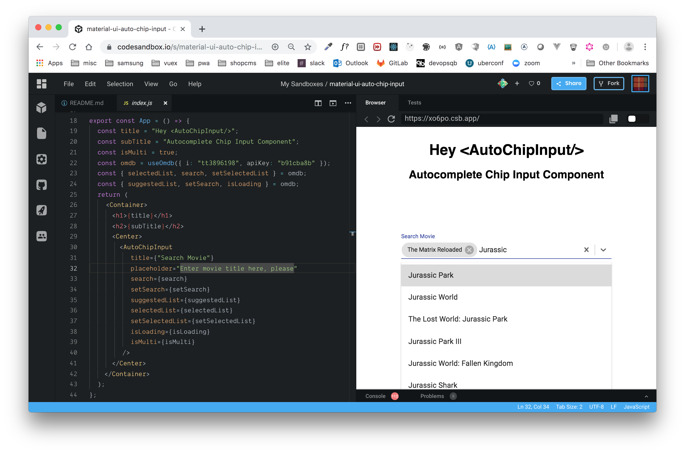

# material-ui-auto-chip-input

This <AutoChipInput/> uses hooks, @material-ui/core 4.3.1,
@material-ui/icons 4.2.1, react-select 3.0.4 or later.



## Usage

```jsx
import AutoChipInput from "material-ui-auto-chip-input";
import { userYourAutoCompleteSuggestion } from './yourSuggestions';

export const App = props => {
  const {
    isLoading // is text searching under way (waiting...)
    search // the text used for searching
    suggestedList // suggestion list of object
    selectedList // list of object selected (support multiple)
    setSearch // function to set serch
    setSelectedList // funcion to set selectedList
    setSuggestedList // function to set suggestedList
  } = useYourAutoCompleteSuggestion();

  return (
    <div>
      <AutoChipInput
          title={"Search Movie"}
          placeholder="Enter movie title here, please"
          search={search}
          setSearch={setSearch}
          suggestedList={suggestedList}
          selectedList={selectedList}
          setSelectedList={setSelectedList}
          isLoading={isLoading}
          isMulti={isMulti}
        />
    </div>
  );
}
```
